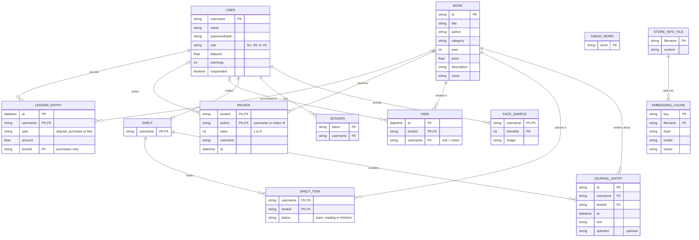

```mermaid
erDiagram
    USER {
        string username PK
        string name
        string passwordHash
        string role "SU, RC or VC"
        float balance
        int warnings
        boolean suspended
    }
    BOOK {
        string id PK
        string title
        string author
        string category
        int year
        float price
        string description
        string cover
    }
    LEDGER_ENTRY {
        datetime at PK
        string username PK, FK
        string type "deposit, purchase or fine"
        float amount
        string bookId FK "purchases only"
    }
    VIEW {
        datetime at PK
        string bookId PK, FK
        string username FK "null = visitor"
    }
    REVIEW {
        string bookId PK, FK
        string author PK, FK "username or visitor id"
        int stars "1 to 5"
        string comment
        datetime at
    }
    TABOO_WORD {
        string word PK
    }
    SHELF {
        string username PK, FK
    }
    SHELF_ITEM {
        string username PK, FK
        string bookId PK, FK
        string status "want, reading or finished"
    }
    JOURNAL_ENTRY {
        string id PK
        string username FK
        string bookId FK
        datetime at
        string text
        string question "optional"
    }
    SESSION {
        string token PK
        string username FK
    }
    FACE_SAMPLE {
        string username PK, FK
        int frameNo PK
        string image
    }
    STORE_INFO_FILE {
        string filename PK
        string content
    }
    EMBEDDING_CACHE {
        string key PK
        string filename FK
        string hash
        string model
        string vector
    }

    USER ||--o{ LEDGER_ENTRY : records
    BOOK |o--o{ LEDGER_ENTRY : "purchased in"
    USER |o--o{ REVIEW : writes
    BOOK ||--o{ REVIEW : receives
    USER |o--o{ VIEW : makes
    BOOK ||--o{ VIEW : "viewed in"
    USER ||--o| SHELF : owns
    SHELF ||--o{ SHELF_ITEM : holds
    BOOK ||--o{ SHELF_ITEM : "placed in"
    SHELF ||--o{ JOURNAL_ENTRY : contains
    BOOK ||--o{ JOURNAL_ENTRY : "written about"
    USER ||--o{ SESSION : has
    USER ||--o{ FACE_SAMPLE : enrolls
    STORE_INFO_FILE ||--o{ EMBEDDING_CACHE : "split into"
```
